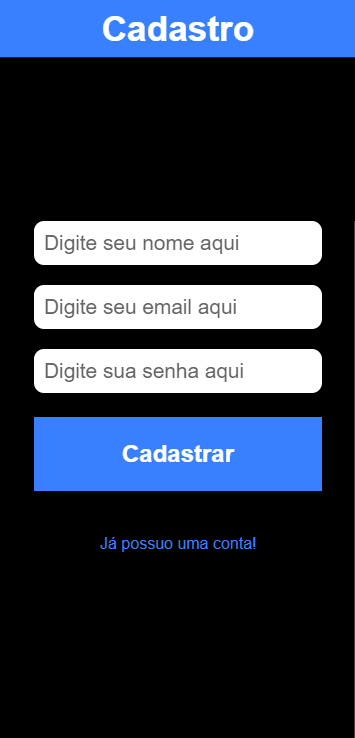
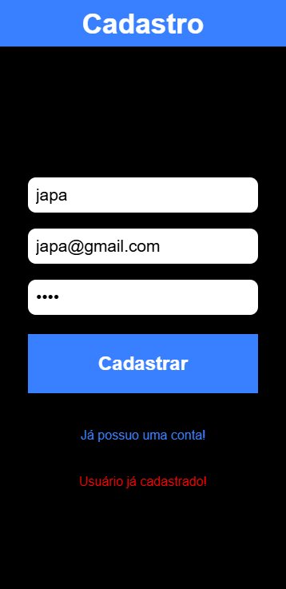
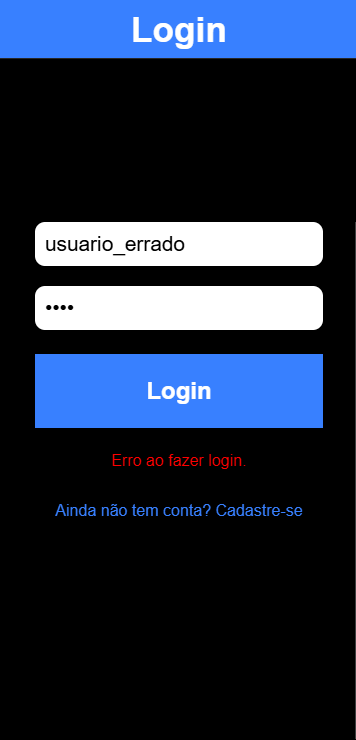
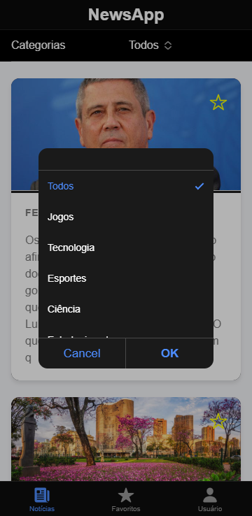
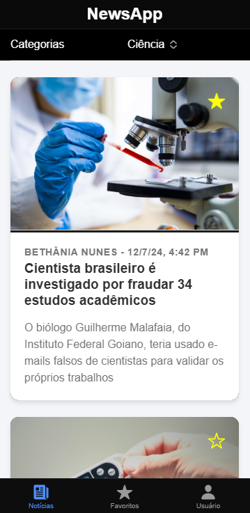
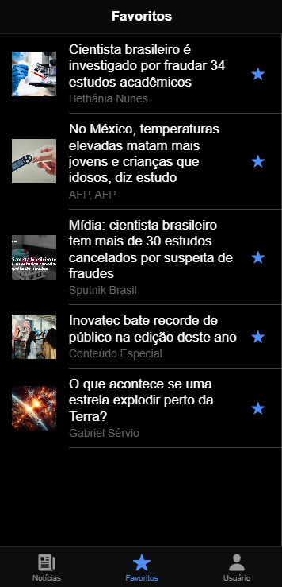
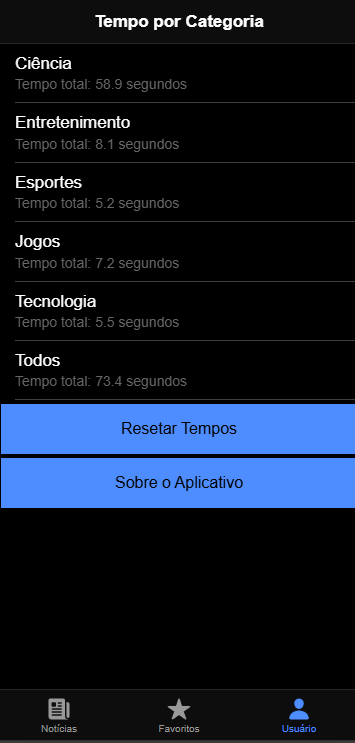
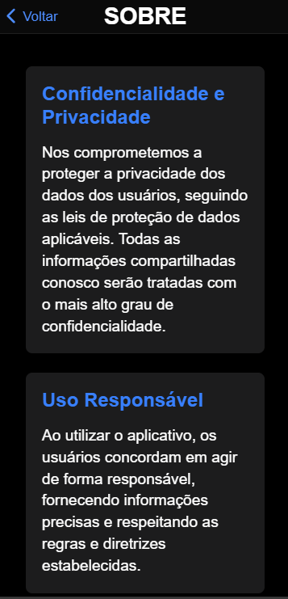
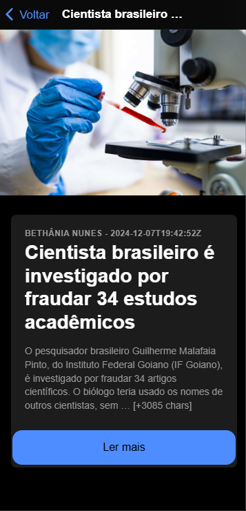

# -IonicNews
O projeto de um aplicativo móvel para android usando ionic com PIs, que tem como objetivo um site de notícias.

## Descrição
O uso do app é simples, feito para facilidade de uso do usuário, seguimos o padrão de sites de notícias mantendo o layout agradavel. Com detalhamento de notícias, favorito e filtros personalizados.


## Tecnologias usadas

* [![Angular][Angular.io]][Angular-url]
* [![Ionic][Ionic.io]][Ionic-url]
* [![Node][Node.js]][Node-url]
*   
* 


## Instalacao
1. API Gratuita: https://newsapi.org/ 
<br>

2. instalar a biblioteca ionic
 ```sh
   npm install -g @ionic/cli
   ```
3. clonar o repositório
 ```sh
   git clone https aqui
   ```   
4. Instalar pacotes npm
   ```sh
   npm install
   ```
5. Insira sua chave na pasta `config.js`
   ```js
   const API_KEY = 'ENTER YOUR API';
   ```

## Modo de Uso

<B>TELA DE CADASTRO</B><br>


<B>USUARIO JA CADASTRADO</B><br> 


<B>ERRO AO FAZER LOGIN</B><br>


<B>FILTRO NOTICIAS</B><br>   


<B>SELECIONAR FAVORITO</B><br> 


<B>TELA DE FAVORITOS</B><br> 


<B>TEMPO DE NAVEGACAO</B><br> 


<B>SOBRE NÓS</B><br> 


<B>NOTÍCIA FAVORITA</B><br> 



## Contribuidores

<a href="https://github.com/Luiz-sassaki"/>

</a>

<a href="https://github.com/joncesar"/>

</a>

### autores

<a href="https://github.com/CarlaMSLopes"/>

</a>

<a href="https://github.com/MnqLopes"/>

</a>

<a href="https://github.com/BrenoMiguelSS"/>

</a>

<a href="https://github.com/JCMS2"/>

</a> 


<div> 
Luiz Fellipe Nunes Sassaki - 01608282 <br>
Jonathan César Gomes Freire Sinício - 01605270 <br>
Breno Miguel Soares da Silva - 01607454<br>
Carla Maria Santana Lopes - 01440665<br>
Monique Rafaela Carvalho Lopes - 01633424<br>
José Carlos Moura Silva - 01530501  
</div>


## License
Distribuído sob a licença não licenciada. Consulte LICENSE para obter mais informações.


[Angular.io]: https://img.shields.io/badge/Angular-DD0031?style=for-the-badge&logo=angular&logoColor=white
[Angular-url]: https://angular.io/
[Ionic.io]: https://img.shields.io/badge/Ionic-3880FF?style=for-the-badge&logo=ionic&logoColor=white
[Ionic-url]: https://ionic.io
[Node.js]: https://img.shields.io/badge/Node.js-339933?style=for-the-badge&logo=node.js&logoColor=white
[Node-url]: https://nodejs.org/pt
